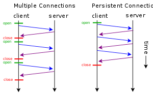

# Tema 5 Fundamentos de arquitectura SOA

## El protocolo HTTP

### Intro

HTTP es un protocolo de la capa OSI de aplicación (conecta un cliente web con un servidor web) que se usa para 
intercambiar información entre sistemas conectados a una red. Es el fundamento de la WWW.

Es un protocolo de comunicación basado en TCP/IP (la información se envía a través de una conexión TCP/IP) que, por 
defecto, usa el puerto 80.

Es de propósito general y sus métodos de petición, parámetros y cabeceras se pueden extender.

Sus características básicas son:

- connectionless: cliente y servidor solo tienen constancia el uno del otro mientras dura la conexión (desde que el 
  cliente hace la petición al servidor hasta que recibe la respuesta)
- media independent: permite intercambiar cualquier tipo de información si ambos, cliente y servidor, saben manejarla y 
  especifican su tipo mediante un MIME-type
- stateless: ni el cliente ni el servidor conservan información de su estado al terminar una conexión

La arquitectura básica es de tipo cliente/servidor.


- cliente (navegador web, curl, wget, etc.): envía una petición al servidor con el formato:

  ~~~
  método + URI + protocol version
  [cabecera CRLF]*
  CRLF
  [cuerpo]
  ~~~

- servidor (apache2, IIS, nginx, etc.): responde con una línea de estado seguida de un MIME-like message

  ~~~
  protocol version + success/error code
  [cabecera CRLF]*
  CRLF
  [cuerpo]
  ~~~

  Las cabeceras pueden ser generales (aplicables a las peticiones y a las respuestas), de petición, de respuesta y de 
  entidad (contienen información acerca del cuerpo o de la URI de la petición)
### Parámetros

Algunos de los principales parámetros (y su sintaxis) usados en los mensajes HTTP son:

- versión del protocolo: HTTP/1.1
- URIs: `"http:" "//" host [ ":" port ] [ abs_path [ "?" query ]]`
  Las siguientes tres URIs son equivalentes

  ~~~
  http://abc.com:80/~smith/home.html
  http://ABC.com/%7Esmith/home.html
  http://ABC.com:/%7esmith/home.html
  ~~~

- hora y fecha: **siempre** en GMT
- juegos de caracteres: especifican las preferencias del cliente. Puede haber uno o más separados por comas
- codificación del contenido: especifica como se puede codificar el contenido antes de enviarlo por la red

  ~~~
  Accept-encoding: gzip
  Accept-encoding: compress
  Accept-encoding: deflated
  ~~~

- media types: proporcionan data typing y type negotiation. Deben estar registrados en el IANA

  ~~~
  Content-Type: image/gif
  Accept: image/jpeg
  ~~~

- tags de lenguaje: 

  ~~~
  Accept-Language: en-US
  Content-Language: es
  ~~~
### Peticiones
#### Formato

El formato genérico de las peticiones es

~~~
método + URI + protocol version
[cabecera (General|Request|Entity) CRLF]*
CRLF
[cuerpo]
~~~

Vamos a ver ejemplos concretos.

#### Métodos

Los métodos que pueden aparecer en la primera línea de la petición (request-line) son:

- GET: obtiene información de un servidor usando una URI
- HEAD: como GET, pero solo obtiene la línea de respuesta (status-line) y las cabeceras
- POST: envía información a un servidor usando un formulario HTML
- PUT: sube información al servidor que reemplaza un recurso ya existente
- DELETE: borra del servidor un recurso ya existente
- CONNECT: establece un túnel a un servidor usando una URI
- OPTIONS: opciones de comunicación para el target resource
- TRACE: realiza una traza de la petición
#### URI

La URI de la request-line se puede especificar de tres maneras:

- `*`

  Por ejemplo `OPTIONS * HTTP/1.1`. Se usa en peticiones que no aplican a un recurso concreto, sino al propio servidor.

- URI absoluta

  Por ejemplo `GET http://www.w3.org/pub/WWW/TheProject.html HTTP/1.1`. Se usa cuando la petición se hace a un proxy,
  que la reenviará desde una de sus caches y devolverá la respuesta al cliente.

- path absoluto

  Es la forma más habitual. Por ejemplo:

  ~~~
  GET /pub/WWW/TheProject.html HTTP/1.1
  Host: www.w3.org
  ~~~

  Se usa cuando la petición se envía directamente al servidor que contiene el recurso, no a un proxy. El path no puede
  estar vacío, debe contener al menos `/` (que representa el server root).
#### Request headers

Las cabeceras de petición permiten al cliente pasar al servidor información adicional sobre la petición y el propio 
cliente.

```{note}

En las peticiones también podemos utilizar las cabeceras generales y de entidad, pero estas las veremos en la seccción 
{ref}`Headers`.
```

Las cabeceras actúan como modificadores de la petición.

Las cabeceras de petición son:

- Accept-Charset
- Accept-Encoding
- Accept-Language
- Authorization
- Expect
- From
- Host
- If-Match
- If-Modified-Since
- If-None-Match
- If-Range
- If-Unmodified-Since
- Max-Forwards
- Proxy-Authorization
- Range
- Referer
- TE
- User-Agent


#### Ejemplos

(peticionGET)=
Pedir el recurso hello.html al servidor web de tutorialspoint.com

~~~
GET /hello.htm HTTP/1.1
User-Agent: Mozilla/4.0 (compatible; MSIE5.01; Windows NT)
Host: www.tutorialspoint.com
Accept-Language: en-us
Accept-Encoding: gzip, deflate
Connection: Keep-Alive
~~~

La cabecera `Connection: Keep-Alive` nos permite usar la cabecera general `Keep-Alive` para hacer sugerencias sobre el
número máximo de peticiones permitidas por conexión y sobre la duración máxima de la conexión TCP:

~~~
HTTP/1.1 200 OK
Connection: Keep-Alive
Content-Encoding: gzip
Content-Type: text/html; charset=utf-8
Date: Thu, 11 Aug 2016 15:23:13 GMT
Keep-Alive: timeout=5, max=1000
Last-Modified: Mon, 25 Jul 2016 04:32:39 GMT
Server: Apache

(body)
~~~

Es decir, las conexiones Keep-Alive permiten al cliente y al servidor usar la misma conexión TCP para enviar y recibir
varias peticiones y varias respuestas. Ver [esta página](https://www.imperva.com/learn/performance/http-keep-alive/) para 
una explicación más detallada.



Las conexiones Keep-Alive están habilitadas por defecto en HTTP/1.1 pero no en HTTP/1.0.

Ejemplo de como enviar un formulario web a un servidor:

~~~
POST /cgi-bin/process.cgi HTTP/1.1
User-Agent: Mozilla/4.0 (compatible; MSIE5.01; Windows NT)
Host: www.tutorialspoint.com
Content-Type: application/x-www-form-urlencoded
Content-Length: length
Accept-Language: en-us
Accept-Encoding: gzip, deflate
Connection: Keep-Alive

licenseID=string&content=string&/paramsXML=string
~~~

La cabecera `Content-Type` nos indica que estamos enviando datos de un formulario. El cuerpo del mensaje contiene los 
campos que estamos enviando separados por `&`. El servidor usará el recurso `/cgi-bin/process.cgi` para procesar los 
datos recibidos

En lugar de un formulario podemos enviar texto XML si cambiamos la cabecera `Content-Type`:

~~~
POST /cgi-bin/process.cgi HTTP/1.1
User-Agent: Mozilla/4.0 (compatible; MSIE5.01; Windows NT)
Host: www.tutorialspoint.com
Content-Type: text/xml; charset=utf-8
Content-Length: length
Accept-Language: en-us
Accept-Encoding: gzip, deflate
Connection: Keep-Alive

<?xml version="1.0" encoding="utf-8"?>
<string xmlns="http://clearforest.com/">string</string>
~~~
### Respuestas
#### Formato

El formato genérico de las respuestas es

~~~
protocol version + status/error code + Reason-Phrase
[cabecera (General|Response|Entity) CRLF]*
CRLF
[cuerpo]
~~~

Vamos a ver ejemplos concretos.
#### Status Codes

Los significados de los códigos de estado son:

- 1XX: informativo

  El servidor informa de que ha recibido la petición y la está procesando
- 2XX: éxito

  El servidor informa de que ha recibido, comprendido y aceptado la petición
- 3XX: redirección

  It means further action must be taken in order to complete the request
- 4XX: error en el cliente

  La petición no se puede completar con éxito o contiene un error de sintaxis
- 5XX: error en el servidor

  La petición es válida pero el servidor no la puede completar con éxito
#### Cabeceras de respuesta

Las más utilizadas son:

- Accept-Ranges
- Age
- ETag
- Location
- Proxy-Authenticate
- Retry-After
- Server
- Vary
- WWW-Authenticate
#### Ejemplos

Respuesta a {ref}`esta petición GET <peticionGET>`

~~~
HTTP/1.1 200 OK
Date: Mon, 27 Jul 2009 12:28:53 GMT
Server: Apache/2.2.14 (Win32)
Last-Modified: Wed, 22 Jul 2009 19:15:56 GMT
Content-Length: 88
Content-Type: text/html
Connection: Closed

<html>
<body>
<h1>Hello, World!</h1>
</body>
</html>
~~~

Respuesta a una petición mal formada (con una versión HTTP incorrecta)

~~~
HTTP/1.1 400 Bad Request
Date: Sun, 18 Oct 2012 10:36:20 GMT
Server: Apache/2.2.14 (Win32)
Content-Length: 230
Content-Type: text/html; charset=iso-8859-1
Connection: Closed
  
<!DOCTYPE HTML PUBLIC "-//IETF//DTD HTML 2.0//EN">
<html>
<head>
   <title>400 Bad Request</title>
</head>
<body>
   <h1>Bad Request</h1>
   <p>Your browser sent a request that this server could not understand.</p>
   <p>The request line contained invalid characters following the protocol string.</p>
</body>
</html>
~~~
### Methods

Ver detalles en [esta página](https://www.tutorialspoint.com/http/http_methods.htm).


#### CONNECT

The CONNECT method is used by the client to establish a network connection to a web server over HTTP. The following 
example requests a connection with a web server running on the host tutorialspoint.com:

~~~
CONNECT www.tutorialspoint.com HTTP/1.1
User-Agent: Mozilla/4.0 (compatible; MSIE5.01; Windows NT)
~~~

The connection is established with the server and the following response is sent back to the client:

~~~
HTTP/1.1 200 Connection established
Date: Mon, 27 Jul 2009 12:28:53 GMT
Server: Apache/2.2.14 (Win32)
~~~
#### OPTIONS

```{note} En el siguiente ejemplo hemos asumido que previamente se ha establecido una conexión TCP entre el cliente y
el servidor.
```

The OPTIONS method is used by the client to find out the HTTP **methods and other options** supported by a web server. The 
client can specify a URL for the OPTIONS method, or an asterisk (*) to refer to the entire server. The following example 
requests a list of methods supported by a web server running on tutorialspoint.com:

~~~
OPTIONS * HTTP/1.1
User-Agent: Mozilla/4.0 (compatible; MSIE5.01; Windows NT)
~~~

The server will send an information based on the current configuration of the server, for example:

~~~
HTTP/1.1 200 OK
Date: Mon, 27 Jul 2009 12:28:53 GMT
Server: Apache/2.2.14 (Win32)
Allow: GET,HEAD,POST,OPTIONS,TRACE
Content-Type: httpd/unix-directory
~~~
#### TRACE

The TRACE method is used to echo the contents of an HTTP Request back to the requester which can be used for debugging 
purpose at the time of development. The following example shows the usage of TRACE method:

~~~
TRACE / HTTP/1.1
Host: www.tutorialspoint.com
User-Agent: Mozilla/4.0 (compatible; MSIE5.01; Windows NT)
~~~

The server will send the following message in response to the above request:

~~~
HTTP/1.1 200 OK
Date: Mon, 27 Jul 2009 12:28:53 GMT
Server: Apache/2.2.14 (Win32)
Connection: close
Content-Type: message/http
Content-Length: 39

TRACE / HTTP/1.1
Host: www.tutorialspoint.com
User-Agent: Mozilla/4.0 (compatible; MSIE5.01; Windows NT)
~~~
(Headers)=
### Headers

To Be Done
### Caching

HTTP is typically used for distributed information systems, where performance can be improved by the use of response 
caches. The HTTP/1.1 protocol includes a number of elements intended to make caching work.

The goal of caching in HTTP/1.1 is to eliminate the need to send requests in many cases, and to eliminate the need to 
send full responses in many other cases.

The basic cache mechanisms in HTTP/1.1 are implicit directives to caches where server-specifies expiration times and 
validators. We use the `Cache-Control` header for this purpose.

The `Cache-Control` header allows a client or server to transmit a variety of directives in either requests or responses. 
These directives typically override the default caching algorithms. The caching directives are specified in a 
comma-separated list. For example, `Cache-control: no-cache`.

The following cache request directives can be used by the client in its HTTP _request_:

- no-cache
  A cache must not use the response to satisfy a subsequent request without successful revalidation with the origin 
  server.

- no-store
  The cache should not store anything about the client request or server response.

- max-age = seconds
  Indicates that the client is willing to accept a response whose age is not greater than the specified time in seconds.

- max-stale [ = seconds ]
  Indicates that the client is willing to accept a response that has exceeded its expiration time. If seconds are given, 
  it must not be expired by more than that time.

- min-fresh = seconds
  Indicates that the client is willing to accept a response whose freshness lifetime is not less than its current age 
  plus the specified time in seconds.

- no-transform
  Does not convert the entity-body.

- only-if-cached
  Does not retrieve new data. The cache can send a document only if it is in the cache, and should not contact the 
  origin-server to see if a newer copy exists.

The following cache response directives can be used by the server in its HTTP _response_:

- public
  Indicates that the response may be cached by any cache.

- private
  Indicates that all or part of the response message is intended for a single user and must not be cached by a shared 
  cache.

- no-cache
  A cache must not use the response to satisfy a subsequent request without successful re-validation with the origin 
  server.

- no-store
  The cache should not store anything about the client request or server response.

- no-transform
  Does not convert the entity-body.

- must-revalidate
  The cache must verify the status of stale documents before using it and expired ones should not be used.

- proxy-revalidate
  The proxy-revalidate directive has the same meaning as the must- revalidate directive, except that it does not apply to 
  non-shared user agent caches.

- max-age = seconds
  Indicates that the client is willing to accept a response whose age is not greater than the specified time in seconds.

- s-maxage = seconds
  The maximum age specified by this directive overrides the maximum age specified by either the max-age directive or the 
  `Expires` header. The s-maxage directive is always ignored by a private cache.
### Seguridad

HTTP is used for communications over the internet, so application developers, information providers, and users should be 
aware of the security limitations in HTTP/1.1. This discussion does not include definitive solutions to the problems 
mentioned here but it does make some suggestions for reducing security risks.


#### Personal Information Leakage

HTTP clients are often privy to large amount of personal information such as the user's name, location, mail address, 
passwords, encryption keys, etc. So you should be very careful to prevent unintentional leakage of this information via 
the HTTP protocol to other sources.

All the confidential information should be stored at the server in encrypted form.

Revealing the specific software version of the server might allow the server machine to become more vulnerable to attacks 
against software that is known to contain security holes.

Proxies that serve as a portal through a network firewall should take special precautions regarding the transfer of 
header information that identifies the hosts behind the firewall.

The information sent in the 'From' field might conflict with the user's privacy interests or their site's security policy, 
and hence, it should not be transmitted without the user being able to disable, enable, and modify the contents of the 
field.

Clients should not include a `Referer` header field in a (non-secure) HTTP request, if the referring page was transferred 
with a secure protocol.

Authors of services that use the HTTP protocol should not use `GET` based forms for the submission of sensitive data, 
because it will cause the data to be encoded in the `Request-URI`.
#### File and Path Names Based Attack

The document should be restricted to the documents returned by HTTP requests to be only those that were intended by the 
server administrators.

For example, UNIX, Microsoft Windows, and other operating systems use `..` as a path component to indicate a directory 
level above the current one. On such a system, an HTTP server MUST disallow any such construct in the `Request-URI`, if it 
would otherwise allow access to a resource outside those intended to be accessible via the HTTP server.
#### DNS Spoofing

Clients using HTTP rely heavily on the Domain Name Service, and are thus generally prone to security attacks based on the 
deliberate mis-association of IP addresses and DNS names. So clients need to be cautious in assuming the continuing 
validity of an IP number/DNS name association.

If HTTP clients cache the results of host name lookups in order to achieve a performance improvement, they must observe 
the TTL information reported by the DNS. If HTTP clients do not observe this rule, they could be spoofed when a 
previously-accessed server's IP address changes.

#### Location Headers and Spoofing

If a single server supports multiple organizations that do not trust one another, then it MUST check the values of 
`Location` and `Content-Location` headers in the responses that are generated under the control of said organizations to 
make sure that they do not attempt to invalidate resources over which they have no authority.

#### Authentication Credentials

Existing HTTP clients and user agents typically retain authentication information indefinitely. HTTP/1.1 does not provide 
a method for a server to direct clients to discard these cached credentials which is a big security risk.

There are a number of work around to the parts of this problem, and so it is recommended to make the use of password 
protection in screen savers, idle time-outs, and other methods that mitigate the security problems inherent in this 
problem.

#### Proxies and Caching

HTTP proxies are men-in-the-middle, and represent an opportunity for man-in-the-middle attacks. Proxies have access to 
security-related information, personal information about individual users and organizations, and proprietary information 
belonging to users and content providers.

Proxy operators should protect the systems on which proxies run, as they would protect any system that contains or 
transports sensitive information.

Caching proxies provide additional potential vulnerabilities, since the contents of the cache represent an attractive 
target for malicious exploitation. Therefore, cache contents should be protected as sensitive information.
## Lo que hay que entender de este tema

```{note} Un web service (a.k.a. API web) es un componente de software accesible en una dirección web (llamada 
`endpoint`). Permite que dos sistemas conectados en red se comuniquen entre sí mediante el intercambio de mensajes. 
Este intercambio se puede llevar a cabo usando protocolos estándar (normalmente SOAP) o con unas reglas menos estrictas 
(como en las APIs REST).

A grandes rasgos el intercambio de mensajes funciona así:

- el cliente envía una petición al endpoint
- la petición se valida en el endpoint y, si es correcta, se envía al servidor
- el servidor envía la respuesta al endpoint
- la respuesta se valida en el endpoint y, si es correcta, se envía al cliente

La arquitectura SOA tiene como objetivo descomponer/separar una aplicación en servicios web independientes. La 
separación se hace en base a la lógica de negocio, por eso se dice que SOA tiene enfoque de empresa.
```
## API

Cuando se habla de APIs (Application Program Interface) se puede hacer en dos contextos diferentes: lenguajes de 
programación y comunicación entre ordenadores dentro de una red.

Dentro de un lenguaje de programación, una API proporciona al lenguaje herramientas para obtener determinada 
funcionalidad que va más alla del propio lenguaje. Por ejemplo, en Java la API proporcionada por el paquete Java.String 
proporciona una serie de métodos/facilidades que permiten manipular objetos tipo String de manera sencilla y potente. 
Java proporciona muchas APIs al desarrollador a través de multitud de paquetes. Lo mismo ocurre, por ejemplo, con Python
(batteries included) donde cada uno de sus numerosos módulos estándar es una API que facilita el uso de determinada 
funcionalidad (trabajo con ficheros, logs, estructuras de datos...).

Estas APIs están disponibles a través de clases, bibliotecas, DLLs, etc. (podemos pensar que la API es la especificación 
de la funcionalidad mientras que la biblioteca es la implementación).

En el contexto de comunicación en red, una API web o servicio web es un componente de software al que se puede acceder
a través de una dirección web. *La API web permite la comunicación entre dos sistemas conectados en red*. En el mundo de
Internet se han popularizado enormemente, ya se trate de web services públicos o privados. Generalmente, la interacción 
se basa en el envío por HTTP de mensajes (solicitudes y respuestas) entre un cliente y un servidor, que incluyen datos. 

Here is how an API works:

- A client application initiates an API call to retrieve information—also known as a request. This request includes a 
request verb, headers, and sometimes, a request body. The request will be sent to the web server via the API's Uniform 
Resource Identifier (URI).
- After receiving a valid request, the API makes a call to the external program or web server.
- The server sends a response to the API with the requested information.
- The API transfers the data to the initial requesting application.

While the data transfer will differ depending on the web service being used, this process of requests and response all 
happens through an API. Whereas a user interface is designed for use by humans, APIs are designed for use by a computer 
or application.

Hay muchos ejemplos de APIs web: una web de servicios de entrega puede tener una API que permita a una web de 
e-commerce consultar y añadir automáticamente el coste de entrega al precio de un producto. De esta manera el 
desarrollador de la web del e-commerce no tiene que añadir y mantener a su BBDD una tabla con los precios de la empresa 
de repartos. Developers don't need to know how an API is implemented; they simply use the interface to communicate with 
other products and services. Vemos que la API facilita la vida al desarrollador, no está orientada al usuario final (si 
un cliente compra un producto en Amazon y el producto se va a entregar por DHL, el coste de la entrega se añade al precio del 
producto y eso es lo que ve el comprador. Si el incremento de precio se ha llevado a cabo con una API o si lo ha
implementado desde cero el desarrollador es transparente para el usuario final). Otros ejemplos de APIs son:

- universal logins: permiten hacer login en una aplicación usando las credenciales de otra. Esto ahorra al usuario la
necesidad de tender unas credenciales distintas para cada aplicación.
- procesamiento de pagos por terceros: esto permite pagar en Internet usando servicios como PayPal, sin tener que
introducir datos bancarios para realizar la transacción
- comparadores de precios para viajes: las APIs permiten acceder a las diferentes web de viajes, obtener los precios y
luego agregarlos a la web del comparador
- Google Maps: las APIs le permiten mostrar multitud de información asociada a las rutas de viaje (todo tipo de 
servicios , como información del tráfico en tiempo real, restaurantes, gasolineras, peluquerías...)
- Twitter: los Tweets públicos y sus respuestas están disponibles a través de una API que permite hacer búsquedas.
Además los desarrolladores pueden publicar Tweets a través de otra API

Para que un desarrollador pueda usar cierta API web tiene que tener acceso a ella. Desde el punto de vista del acceso
hay varios tipos de API web:

- abiertas o públicas: están escritas en código abierto y los endpoint son públicos
- de socios: solo disponibles para socios estratégicos de una empresa. Los desarrolladores necesitan autenticarse para
acceder a ellas
- internas o privadas: solo disponibles para los desarrolladores de la empresa
- compuestas: permiten a los desarrolladores acceder a varios endpoint con una sola llamada. Útiles en arquitectura de
microservicios

Una API web suele utilizar uno de los siguientes protocolos para el intercambio de mensajes:

- SOAP: construido en XML, utiliza HTTP como capa de transporte. Es independiente del sistema operativo y del lenguaje
- XML-RPC: más sencillo y ligero (y antigüo) que SOAP, pero menos potente
- JSON-RPC: como el XML-RPC pero usa JSON en lugar de XML
- REST: no es un protocolo ni un estándar sino un conjunto de principios de uso de arquitectura. Si una API web usa esos
principios se dice que es una API REST

Las APIs web han evolucionado con el tiempo:

- primero fue el protocolo SOAP
- luego llegaron las API REST

WSDL is an XML notation for describing a web service. A WSDL definition tells a client how to compose a web service 
request and describes the interface that is provided by the web service provider. A WSDL definition is divided into 
separate sections that specify the logical interface and the physical details of a web service. The physical details 
include both endpoint information, such as HTTP port number, and binding information, which specifies how the SOAP 
payload is represented and which transport is used.

## Arquitectura SOA

Service Oriented Architecture es una metodología de arquitectura de software. Permite especificar la separación de
responsabilidades en servicios independientes que se comunican entre sí usando APIs (a menudo, pero no siempre
publicando eventos en un bus). La separación de responsabilidades en servicios se hace desde el punto de vista del 
negocio, por eso se dice que SOA tiene un enfoque de empresa.

As an example, you could have one service responsible for capturing customer orders, which publishes an OrderCaptured 
event to the bus; and a separate service responsible for tracking when the customer is billed and how much is owed, 
which subscribes to the Bus and responds to the OrderCaptured event. The first service might not need to know anything 
about billing due to the separation of responsibility. And the two services don't need to know about each other either, 
only about the events going on around them.

As you see, each service in SOA embodies the code and data required to execute a complete, discrete business function 
(e.g. checking a customer's credit, calculating a monthly loan payment, or processing a mortgage application).

La comunicación con los servicios a través de APIs proporciona bajo acoplamiento, lo que significa que se les puede 
llamar con poco o ningún conocimiento de su implementación. Los servicios se exponen utilizando protocolos de red 
estándar, como SOAP (Simple Object Access Protocol)/HTTP o JSON/HTTP, para enviar peticiones de lectura o modificación 
de datos.

Las ventajas de SOA son:

- *Reusabilidad de los servicios*. SOA permite construir diferentes aplicaciones a partir de los mismos servicios, 
facilita la integración de aplicaciones, la integración de datos y la orquestación de aplicaciones.
- En SOA los servicios se definen en función del negocio: encapsula el código y datos necesarios para ejecutar una 
función de negocio concreta. Eso facilita la comunicación entre los analistas de negocio y los desarrolladores.
- Potencia el uso de legacy systems más allá de su utilidad original. For example, many companies have used SOA to 
expose functionality from mainframe-based financial systems to new web applications, enabling their customers to serve 
themselves to processes and information previously accessible only through direct interaction with the company's 
employees or business partners.

Antes del auge de SOA a finales de los años 90 la conexión entre dos aplicaciones diferentes requería una integración 
punto a punto muy compleja, que los desarrolladores debían crear, en mayor parte a medida, para cada proyecto. La 
exposición de funcionalidad mediante SOA elimina la necesidad de recrear esa integración profunda cada vez.
## El protocolo SOAP

SOAP es el acrónimo de Simple Object Access Protocol. Es un protocolo de mensajería basado en XML que se usa para
intercambiar información entre ordenadores. Es una aplicación de la especificación XML.
### Introducción

Aspectos destacables son:

- SOAP is a communication protocol designed to communicate via Internet.
- SOAP can extend HTTP for XML messaging.
- _SOAP provides data transport for Web services_.
- SOAP can exchange complete documents or call a remote procedure.
- SOAP can be used for broadcasting a message.
- _SOAP is platform- and language-independent_.
- SOAP is the XML way of defining what information is sent and how.
- SOAP enables client applications to easily connect to remote services and invoke remote
methods.

The initial focus of SOAP is remote procedure calls transported via HTTP.

```{note} SOAP es un protocolo de mensajería mientras que HTTP es un protocolo de transporte.
Los mensajes SOAP se transportan vía HTTP de un nodo de la red a otro utilizando conexiones TCP/IP.
```
### Messages

A SOAP message is an ordinary XML document containing the following elements:

- Envelope : Defines the start and the end of the message. It is a mandatory element.
- Header: Contains any optional attributes of the message used in processing the message, either at an intermediary point 
  or at the ultimate end-point. It is an optional element.
- Body: Contains the XML data comprising the message being sent. It is a mandatory element.
- Fault: An optional Fault element that provides information about errors that occur while processing the message.

All these elements are declared in the [default namespace for the SOAP envelope](http://www.w3.org/2001/12/soap-envelope)
and the [default namespace for SOAP encoding and data types](http://www.w3.org/2001/12/soap-encoding).

The following block depicts the general structure of a SOAP message:

~~~ xml
<?xml version="1.0"?>
<SOAP-ENV:Envelope
xmlns:SOAP-ENV="http://www.w3.org/2001/12/soap-envelope"
SOAP-ENV:encodingStyle="http://www.w3.org/2001/12/soap-encoding">
  <SOAP-ENV:Header>
    ...
    ...
  </SOAP-ENV:Header>
  <SOAP-ENV:Body>
    ...
    ...
    <SOAP-ENV:Fault>
    ...
    ...
    </SOAP-ENV:Fault>
  </SOAP-ENV:Body>
</SOAP_ENV:Envelope>
~~~

El siguiente ejemplo muestra como enviar un mensaje SOAP con el método `POST` de `HTTP`:

~~~ http
POST /OrderEntry HTTP/1.1
Host: www.tutorialspoint.com
Content-Type: application/soap;  charset="utf-8"
Content-Length: nnnn

<?xml version = "1.0"?>
<SOAP-ENV:Envelope 
   xmlns:SOAP-ENV = "http://www.w3.org/2001/12/soap-envelope" 
   SOAP-ENV:encodingStyle = " http://www.w3.org/2001/12/soap-encoding">
   ...
   Message information goes here
   ...
</SOAP-ENV:Envelope>
~~~

(ruta_mensaje)=
```{note} El protocolo SOAP define la ruta de un mensaje como una lista de nodos con servicios SOAP que pueden procesar dicho 
mensaje.
```
### Envelope

En SOAP el sobre es un mecanismo de empaquetado de información. Indica donde empieza y donde termina el mensaje, de 
manera que el receptor sabe cuando puede empezar a procesar dicho mensaje.

Puntos a tener en cuenta son:

- The Envelope is mandatory. Every SOAP message has a root `Envelope` element.
- The SOAP envelope is specified using `namespace prefix:Envelope`.
- The optional SOAP encoding is also specified using a namespace name and the optional `encodingStyle` element, which 
  could also point to an encoding style other than the SOAP one. El encoding define los tipos de datos soportados.
- Every `Envelope` element must contain exactly one `Body` element.
- If an `Envelope` contains a `Header` element, it must contain no more than one, and it must appear as the first child 
  of the `Envelope`, before the `Body`.
- The envelope changes when SOAP versions change (porque la versión se especifica en el namespace, ver ejemplo).
- A v1.1-compliant SOAP processor generates a fault upon receiving a message containing the v1.2 envelope namespace.
- A v1.2-compliant SOAP processor generates a `VersionMismatch` fault if it receives a message that does not include the v1.2 envelope namespace.

~~~ xml
<?xml version = "1.0"?>
<SOAP-ENV:Envelope 
   xmlns:SOAP-ENV = "http://www.w3.org/2001/12/soap-envelope" 
   SOAP-ENV:encodingStyle = " http://www.w3.org/2001/12/soap-encoding">
   ...
   Message information goes here
   ...
</SOAP-ENV:Envelope>
~~~
### Header

La cabecera SOAP permite añadir requerimientos específicos a nivel de aplicación, por ejemplo, una firma digital en un
servicio protegido por contraseña, o un número de cuenta en un servico de pago por uso.

Puntos a tener en cuenta son:

- It is an optional part of a SOAP message.
- Headers are intended to add new features and functionality.
- The header is encoded as the first immediate child element of the SOAP envelope.
- The SOAP header contains header entries defined in a namespace.
- Header children elements can occur multiple times.
- When multiple header children are defined, all immediate child elements of the SOAP header are interpreted as SOAP 
  `header blocks`.
#### Header attributes

Una cabecera SOAP puede tener solo dos atributos: `Actor` y `MustUnderstand`.

Con el atributo `Actor` el cliente puede especificar que nodo de {ref}`la ruta del mensaje <ruta_mensaje>` es el 
destinatario de la cabecera y, por tanto, el encargado de procesarla.

El atributo `MustUnderstand` indica si la cabecera es obligatoria o no. Un valor `true` significa que el receptor debe
entender y procesar la cabecera o retornar un fallo.

Ejemplo de mensaje con una cabecera con un hijo:

~~~ xml
<?xml version = "1.0"?>
<SOAP-ENV:Envelope 
   xmlns:SOAP-ENV = " http://www.w3.org/2001/12/soap-envelope"   
   SOAP-ENV:encodingStyle = " http://www.w3.org/2001/12/soap-encoding">

   <SOAP-ENV:Header>
      <t:Transaction 
         xmlns:t = "http://www.tutorialspoint.com/transaction/" 
         SOAP-ENV:mustUnderstand = "true">5
      </t:Transaction>
   </SOAP-ENV:Header>
   ...
   ...
</SOAP-ENV:Envelope>
~~~
### Cuerpo

El cuerpo es un elemento obligatorio en los mensajes SOAP. Contiene los datos que se transmiten en el mensaje, destinados
al receptor final (el end-point, el último nodo de la ruta del mensaje).


### Fallo

Si al procesar la petición ocurre un error, la respuesta devuelta contendrá un elemento `Fault` en el cuerpo del mensaje.

El mecanismo de fallo de SOAP devuelve información específica del error: código, descripción, dirección del nodo que 
generó el error.

Puntos a tener en cuenta:

- un mensaje puede contener como máximo un bloque de fallo
- los códigos de éxito están en el rango 200 a 299, como en HTTP
- los códigos de error están en el rango 500 a 599, como en HTTP

Los subelementos de `Fault` son:

- faultCode: el código de error
- faultString: la descripción del error
- faultActor: el nodo que causó el error. Este elemento es obligatorio si el nodo que está procesando la petición no es 
  el end-point
- detail: contiene mensajes de error específicos de la aplicación. Puede contener subelementos.

Los códigos de error son:

- SOAP-ENV:VersionMismatch
- SOAP-ENV:MustUnderstand
- SOAP-ENV:Client
- SOAP-ENV:Server

The following code is a sample Fault. The client has requested a method named ValidateCreditCard, but the service does 
not support such a method. This represents a client request error, and the server returns the following SOAP response:

~~~ xml
<?xml version = '1.0' encoding = 'UTF-8'?>
<SOAP-ENV:Envelope
   xmlns:SOAP-ENV = "http://schemas.xmlsoap.org/soap/envelope/"
   xmlns:xsi = "http://www.w3.org/1999/XMLSchema-instance"
   xmlns:xsd = "http://www.w3.org/1999/XMLSchema">

   <SOAP-ENV:Body>
      <SOAP-ENV:Fault>
         <faultcode xsi:type = "xsd:string">SOAP-ENV:Client</faultcode>
         <faultstring xsi:type = "xsd:string">
            Failed to locate method (ValidateCreditCard) in class (examplesCreditCard) at
               /usr/local/ActivePerl-5.6/lib/site_perl/5.6.0/SOAP/Lite.pm line 1555.
         </faultstring>
      </SOAP-ENV:Fault>
   </SOAP-ENV:Body>
</SOAP-ENV:Envelope>
~~~
### Tipos de datos

SOAP soporta la codificación de tipos de datos escalares (cadenas, booleanos, enteros, coma flotante, dobles...) y 
compuestos (arrays y structs) a través de un conjunto de reglas internas. El estilo de la codificación se asigna en el 
atributo `SOAP-ENV:encodingStyle`.

Ejemplo de respuesta que utiliza el tipo de datos doble:

~~~ xml
<?xml version = '1.0' encoding = 'UTF-8'?>
<SOAP-ENV:Envelope 
   xmlns:SOAP-ENV = "http://www.w3.org/2001/12/soap-envelope"
   xmlns:xsi = "http://www.w3.org/2001/XMLSchema-instance" 
   xmlns:xsd = "http://www.w3.org/2001/XMLSchema">
   
   <SOAP-ENV:Body>
      <ns1:getPriceResponse 
         xmlns:ns1 = "urn:examples:priceservice"  
         SOAP-ENV:encodingStyle = "http://www.w3.org/2001/12/soap-encoding">
         <return xsi:type = "xsd:double">54.99</return>
      </ns1:getPriceResponse>
   </SOAP-ENV:Body>
</SOAP-ENV:Envelope>
~~~

Ejemplo de respuesta que utiliza un array de dobles:

~~~ xml
<?xml version = '1.0' encoding = 'UTF-8'?>
<SOAP-ENV:Envelope
   xmlns:SOAP-ENV = "http://www.w3.org/2001/12/soap-envelope" 
   xmlns:xsi = "http://www.w3.org/2001/XMLSchema-instance" 
   xmlns:xsd = "http://www.w3.org/2001/XMLSchema">

   <SOAP-ENV:Body>
      <ns1:getPriceListResponse 
         xmlns:ns1 = "urn:examples:pricelistservice"  
         SOAP-ENV:encodingStyle = "http://www.w3.org/2001/12/soap-encoding">

         <return xmlns:ns2 = "http://www.w3.org/2001/09/soap-encoding"  
            xsi:type = "ns2:Array" ns2:arrayType = "xsd:double[2]">
            <item xsi:type = "xsd:double">54.99</item>
            <item xsi:type = "xsd:double">19.99</item>
         </return>
      </ns1:getPriceListResponse>
   </SOAP-ENV:Body>
</SOAP-ENV:Envelope>
~~~

También se soportan arrays multidimensionales.

Ejemplo de respuesta que utiliza un tipo de datos struct:

~~~ xml
<?xml version = '1.0' encoding = 'UTF-8'?>
<SOAP-ENV:Envelope 
   xmlns:SOAP-ENV = "http://www.w3.org/2001/12/soap-envelope"
   xmlns:xsi = "http://www.w3.org/2001/XMLSchema-instance" 
   xmlns:xsd = "http://www.w3.org/2001/XMLSchema">

   <SOAP-ENV:Body>
      <ns1:getProductResponse
         xmlns:ns1 = "urn:examples:productservice" 
         SOAP-ENV:encodingStyle = "http://www.w3.org/2001/12/soap-encoding">
		
         <return xmlns:ns2 = "urn:examples" xsi:type = "ns2:product">
            <name xsi:type = "xsd:string">Red Hat Linux</name>
            <price xsi:type = "xsd:double">54.99</price>
            <description xsi:type = "xsd:string">
               Red Hat Linux Operating System
            </description>
            <SKU xsi:type = "xsd:string">A358185</SKU>
         </return>
      </ns1:getProductResponse>
   </SOAP-ENV:Body>
</SOAP-ENV:Envelope>
~~~

En este ejemplo se define un struct llamado `product` con cuatro pares clave-valor, siendo las claves 
`name` (cadena), `price` (doble), `description` (cadena) y `SKU` (cadena).

### Transporte

Los mensajes SOAP se pueden transportar con muchos protocolos (SMTP, FTP, MSMQ...) pero el más popular es HTTP.

Quite logically, SOAP requests are sent via an HTTP request and SOAP responses are returned within the content of the 
HTTP response. While SOAP requests can be sent via an HTTP `GET`, the specification includes details on HTTP `POST` only.

Additionally, both HTTP requests and responses are required to set their content type to text/xml.

The SOAP specification mandates that the client must provide a `SOAPAction` header, but the actual value of the 
`SOAPAction` header is dependent on the SOAP server implementation.

If the server does not require a full `SOAPAction` header, the client must specify an empty string ("") or a null value.

Here is a sample request sent via HTTP to the XMethods Babelfish Translation service:

~~~ http
POST /perl/soaplite.cgi HTTP/1.0
Host: services.xmethods.com
Content-Type: text/xml; charset = utf-8
Content-Length: 538
SOAPAction: "urn:xmethodsBabelFish#BabelFish"

<?xml version = '1.0' encoding = 'UTF-8'?>
<SOAP-ENV:Envelope 
   xmlns:SOAP-ENV = "http://schemas.xmlsoap.org/soap/envelope/" 
   xmlns:xsi = "http://www.w3.org/1999/XMLSchema-instance"
   xmlns:xsd = "http://www.w3.org/1999/XMLSchema">

   <SOAP-ENV:Body>
      <ns1:BabelFish
         xmlns:ns1 = "urn:xmethodsBabelFish"
         SOAP-ENV:encodingStyle = "http://schemas.xmlsoap.org/soap/encoding/">
         <translationmode xsi:type = "xsd:string">en_fr</translationmode>
         <sourcedata xsi:type = "xsd:string">Hello, world!</sourcedata>
      </ns1:BabelFish>
   </SOAP-ENV:Body>
</SOAP-ENV:Envelope>
~~~

Note the content type and the `SOAPAction` header. Also note that the BabelFish method requires two String parameters. 
The translation mode en_fr translates from English to French.

Here is the response from XMethods:

~~~ http
HTTP/1.1 200 OK
Date: Sat, 09 Jun 2001 15:01:55 GMT
Server: Apache/1.3.14 (Unix) tomcat/1.0 PHP/4.0.1pl2
SOAPServer: SOAP::Lite/Perl/0.50
Cache-Control: s-maxage = 60, proxy-revalidate
Content-Length: 539
Content-Type: text/xml

<?xml version = "1.0" encoding = "UTF-8"?>
<SOAP-ENV:Envelope
   xmlns:SOAP-ENC = "http://schemas.xmlsoap.org/soap/encoding/"
   SOAP-ENV:encodingStyle = "http://schemas.xmlsoap.org/soap/encoding/"
   xmlns:xsi = "http://www.w3.org/1999/XMLSchema-instance"
   xmlns:SOAP-ENV = "http://schemas.xmlsoap.org/soap/envelope/"
   xmlns:xsd = "http://www.w3.org/1999/XMLSchema">
   
   <SOAP-ENV:Body>
      <namesp1:BabelFishResponse xmlns:namesp1 = "urn:xmethodsBabelFish">
         <return xsi:type = "xsd:string">Bonjour, monde!</return>
      </namesp1:BabelFishResponse>
   </SOAP-ENV:Body>
</SOAP-ENV:Envelope>
~~~

SOAP responses delivered via HTTP are required to follow the same HTTP status codes. For example, a status code of 
`200 OK` indicates a successful response. A status code of `500 Internal Server Error` indicates that there is a server 
error and that the SOAP response includes a `Fault` element.
### Ejemplos

#### Ejemplo 1: cabecera

Ejemplo completo con énfasis en la cabecera.

Petición:

~~~ xml
<s:Envelope xmlns:s="http://schemas.xmlsoap.org/soap/envelope/">
   <s:Header>
     <Action s:mustUnderstand="1" 
       xmlns="http://schemas.microsoft.com/ws/2005/05/addressing/none">
       http://tempuri.org/IService/MyOperation
     </Action>
     <ActivityId CorrelationId="7224e2a9-8f9c-4acb-a924-17cb6af67b23"
 xmlns="http://schemas.microsoft.com/2004/09/ServiceModel/Diagnostics">
       43ffa660-a0c6-4249-bb36-648b73a06213</ActivityId>
   </s:Header>
   <s:Body>
     <MyOperation xmlns="http://tempuri.org">
       <MyValue>Some Value</MyValue>
     </MyOperation>
   </s:Body>
</s:Envelope>
 ~~~

 Respuesta a la petición anterior:

 ~~~ xml
  <s:Envelope xmlns:s="http://schemas.xmlsoap.org/soap/envelope/">
   <s:Header>
     <Action s:mustUnderstand="1"
       xmlns="http://schemas.microsoft.com/ws/2005/05/addressing/none">
       http://tempuri.org/IService/MyOperation
     </Action>
     <ActivityId CorrelationId="b898336e-d4e2-4eb7-a2c7-1e23f4630646" 
 xmlns="http://schemas.microsoft.com/2004/09/ServiceModel/Diagnostics">
       43ffa660-a0c6-4249-bb36-648b73a06213</ActivityId>
   </s:Header>
   <s:Body>
     <MyOperationResponse xmlns="http://tempuri.org">
       <MyOperationResult>
         <MyValue>Some Value</MyValue>
       </MyOperationResult>
     </MyOperationResponse>
   </s:Body>
 </s:Envelope>
 ~~~
#### Ejemplo 2: cuerpo

Ejemplo completo con énfasis en el cuerpo.

Petición:

~~~ xml
<?xml version = "1.0"?>
<SOAP-ENV:Envelope>
   ........
   <SOAP-ENV:Body>
      <m:GetQuotation xmlns:m = "http://www.tp.com/Quotation">
         <m:Item>Computers</m:Item>
      </m:GetQuotation>
   </SOAP-ENV:Body>
</SOAP-ENV:Envelope>
~~~

Respuesta:

~~~ xml
<?xml version = "1.0"?>
<SOAP-ENV:Envelope>
   ........
   <SOAP-ENV:Body>
      <m:GetQuotationResponse xmlns:m = "http://www.tp.com/Quotation">
         <m:Quotation>This is Qutation</m:Quotation>
      </m:GetQuotationResponse>
   </SOAP-ENV:Body>
</SOAP-ENV:Envelope>
~~~

Normalmente la aplicación define un esquema con la semántica asociada a los elementos que contienen la petición y la 
respuesta. En este ejemplo es `xmlns:m = "http://www.tp.com/Quotation"`. 

```{note} Los elementos de este esquema (<code>m:GetQuotation</code>, <code>m:Item</code>, etc.) son específicos
de la aplicación, **no son parte del estándar SOAP**.
```
#### Ejemplo completo

In the example below, a `GetQuotation` request is sent to a SOAP Server over HTTP. The request has a `QuotationsName` 
parameter, and a `Quotation` will be returned in the response.

The namespace for the function is defined in http://www.xyz.org/quotation address.

Here is the SOAP request:

~~~ http
POST /Quotation HTTP/1.0
Host: www.xyz.org
Content-Type: text/xml; charset = utf-8
Content-Length: nnn

<?xml version = "1.0"?>
<SOAP-ENV:Envelope
   xmlns:SOAP-ENV = "http://www.w3.org/2001/12/soap-envelope"
   SOAP-ENV:encodingStyle = "http://www.w3.org/2001/12/soap-encoding">

   <SOAP-ENV:Body xmlns:m = "http://www.xyz.org/quotations">
      <m:GetQuotation>
         <m:QuotationsName>MiscroSoft</m:QuotationsName>
      </m:GetQuotation>
   </SOAP-ENV:Body>
</SOAP-ENV:Envelope>
~~~

A corresponding SOAP response looks like:

~~~ http
HTTP/1.0 200 OK
Content-Type: text/xml; charset = utf-8
Content-Length: nnn

<?xml version = "1.0"?>
<SOAP-ENV:Envelope
   xmlns:SOAP-ENV = "http://www.w3.org/2001/12/soap-envelope"
   SOAP-ENV:encodingStyle = "http://www.w3.org/2001/12/soap-encoding">

   <SOAP-ENV:Body xmlns:m = "http://www.xyz.org/quotation">
      <m:GetQuotationResponse>
         <m:Quotation>Here is the quotation</m:Quotation>
      </m:GetQuotationResponse>
   </SOAP-ENV:Body>
</SOAP-ENV:Envelope>
~~~
## JSON

JSON (JavaScript Object Notation) es un formato de representación ligero, habitualmente utilizado para el intercambio de 
datos.

Está basado en un subconjunto del lenguaje de programación JavaScript (concretamente en el modo en que se construyen 
objetos).

JavaScript permite serializar objetos en cadenas de texto representadas en formato JSON, para luego de-serializarlas de 
vuelta a objetos JavaScript.

Las reglas de sintaxis de JSON se derivan de las reglas de notación de objetos de JavaScript:

- Los datos se representan en pares clave/valor
- Los datos se separan por comas
- Las llaves(“{“ y “}”) encapsulan objetos
- Los corchetes (“[“ y “]”) encapsulan colecciones (arrays)
- Las comillas dobles son obligatorias en los nombres de propiedad y en las cadenas
- No puede estar vacío (“null” es un JSON válido, pero “” no lo es)
- No se permiten los ceros a la izquierda en la definición de datos numéricos
- Los números en coma flotante usan el punto “.” para delimitar
